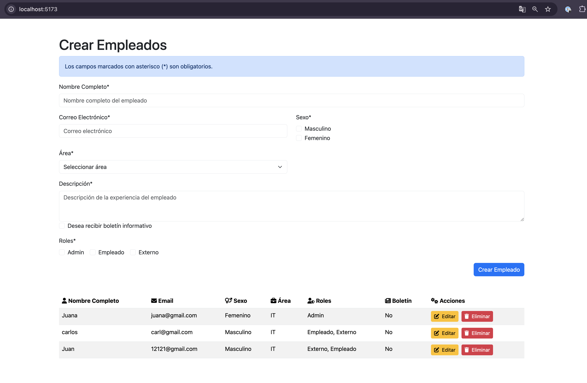

# Prueba parte frontend

## Descripcion

Prueba Nexura - CRUD EMPLEADOS. Desarrollado con React, TypeScript, Postman y Docker starter repository.

## Copilar e iniciar

```bash
# development
$ npm run dev
```

## Asi se debe ver


